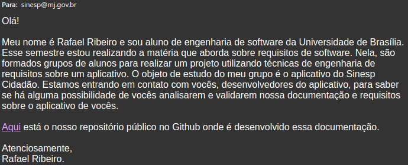

## Validação

### Introdução

 &emsp;&emsp;
A validação são técnicas aquelas que auxiliam a confirmar que o produto satisfaz sua intenção de uso. Atividades
de validação atentam para confirmar se o produto satisfaz as expectativas dos seus usuários.
Desta maneira, geralmente são realizadas no produto final de uma determinada atividade,
que é testado extensivamente, mas sobre o ponto de vista do cliente. A validação avalia se o
produto entregue cumpre com as expectativas do usuário, ou seja, foi entregue o produto
correto? 

### Método utilizado

 &emsp;&emsp;
 Em geral, a validação de requisitos é considerada uma atividade complicada. Um dos motivos é social e está relacionado com a dificuldade de obter um consenso entre diferentes usuários com objetivos conflitantes. Outro grande desafio durante a validação de requisitos é demonstrar que a especificação dos requisitos do sistema está correta. Contudo existem várias técnicas que podem ser aplicadas para suportar a validação de requisitos: revisões dos requisitos, prototipação, teste de requisitos, validação dos modelos, comprovação informal e baseada no ponto de vista. Para este projeto foi escolhido a comprovação informal. Essa técnica consiste entrar em contato com os stakeholders para saber se o produto realmente atende as necessidades dos usuários.

 &emsp;&emsp;
E para realizar essa técnica de validação, entramos em contato com a empresa que é responsável pelo desenvolvimento e manutenção do aplicativo através do email "sinesp@mj.gov.br", afim de validar o que foi realizado durante a disciplina de Requisitos. A abaixo está o email que foi enviado.

### Referências

[Ajax, Ricardo. Slides Conceitos Fundamentais - V&V + Erro, defeito, falha](https://aprender3.unb.br/pluginfile.php/329508/mod_resource/content/2/A4%20-%20TS%20-%20206580_Conceitos%20Fundamentais%20-%20%281%29%20Ver%20Val%20Erro%20Defeito%20Falha.pdf). Acesso em: 08/11/2020.

[SERRANO, Maurício; SERRANO, Milene; Requisitos – Aula 23 Elicitação, Modelagem, Análise](https://aprender3.unb.br/pluginfile.php/426773/mod_resource/content/2/Requisitos%20-%20Aula%20023.pdf). Acesso em: 08/11/2020.

## Versionamento
Data | Versão | Descrição | Autor 
------ | --------- | ---------- | --------
03/11/2020 | 0.1 | Introdução e metodologia | Rafael Ribeiro