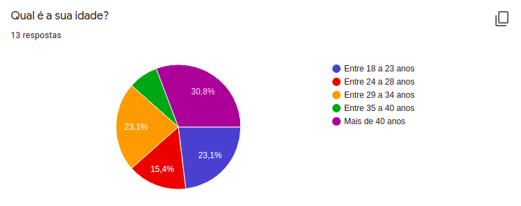
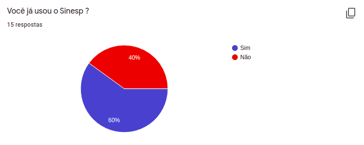
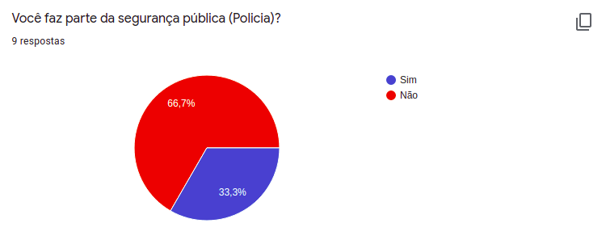
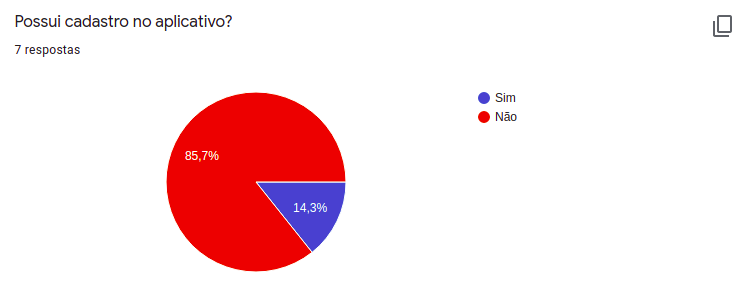
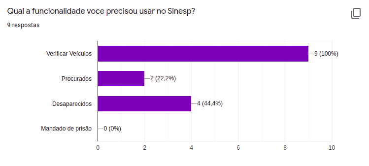
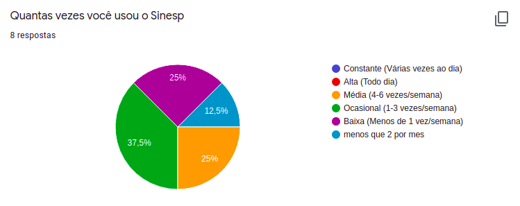
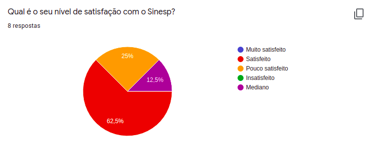

# Questionário

## Introdução

 &emsp;&emsp;
É uma técnica que tem um alcance muito grande no número de pessoas. Ela é muito utilizada quando há indisponibilidade física, dispersão dos envolvidos ou quando há a necessidade de um levantamento estatístico sob qualquer aspecto envolvendo os interessados. As perguntas são organizadas com o objetivo de levantar dados para uma pesquisa ou estudo, cujas respostas são fornecidas pelo informante sem a orientação direto do pesquisador.

## Questões

### Questão 1

### Questão 2

### Questão 3

### Questão 4

### Questão 5

### Questão 6

### Questão 7

## Conclusão

 &emsp;&emsp;
Com base na quantidade de respostas obtidas com o formulário, não foi possível encontrar uma quantidade grande de usuários do aplicativo Sinesp Cidadão, porém várias propriedades e funcionalidades indicadas por não usuários do aplicativo fazem parte do Sinesp.

## Referências

[SERRANO, Maurício; SERRANO, Milene; Requisitos – Aula 07](https://aprender3.unb.br/pluginfile.php/426730/mod_resource/content/2/Requisitos%20-%20Aula%2007.pdf)

## Versionamento
Data | Versão | Descrição | Autor 
------ | --------- | ---------- | --------
25/11/2020 | 1.0 | Adição da Elicitação restante: Questionário | Fellipe e Itallo