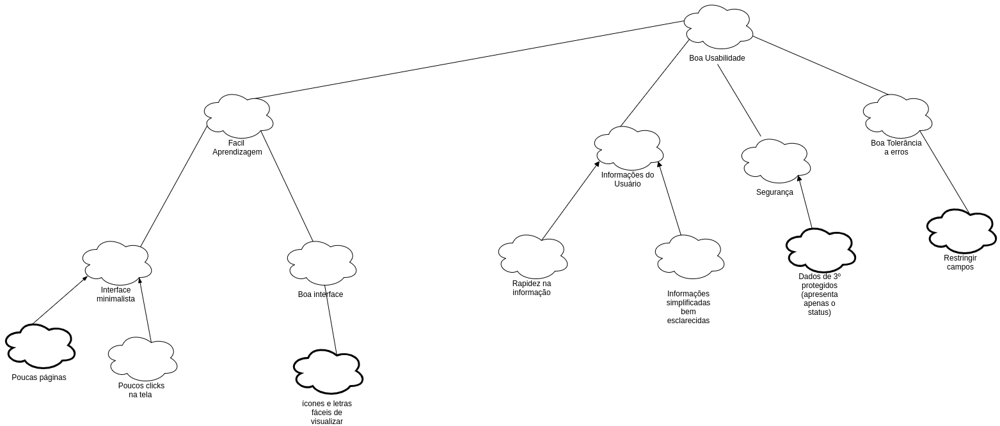
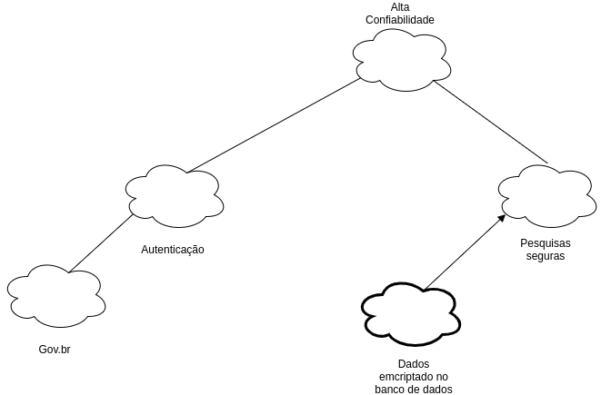

# NFR Framework

## Introdução

 &emsp;&emsp;
O NFR Framework é uma abordagem para representar e analisar Requisitos Não-Funcionais com o objetivo de ajudar desenvolvedores na implementação de soluções personalizadas, levando em consideração as características do domínio e do sistema em questão. O NFR Framework criado por (CHUNG et al., 2000), foi adotado por propor uma abordagem específica para o tratamento de Requisitos Não-Funcionais e fornecer uma rica representação para expressar esses requisitos, além de suas relações e correlações. Abaixo está representado o NFR Geral e os NFR's dos seguintes tópicos: Usabilidade, Confiabilidade, Performance e Suportabilidade.

## NFR's

### NFR Geral

### NFR - Performance e Portabilidade

### Propagação

### Usabilidade

### Confiabilidade

 

### Referências

[SERRANO, Maurício; SERRANO, Milene; Requisitos – Aula 16](https://aprender3.unb.br/pluginfile.php/426768/mod_resource/content/1/Requisitos%20-%20Aula%20019a.pdf)

[Dissertação de mestrado: "NFR4ES: um Catálogo de Requisitos Não-Funcionais para Sistemas Embarcados" de Reinaldo Antônio da Silva, de 2019 .Arquivo](https://aprender3.unb.br/pluginfile.php/573096/mod_resource/content/2/DISSERTA%C3%87%C3%83O%20Reinaldo%20Ant%C3%B4nio%20da%20Silva.pdf)

## Versionamento
Data | Versão | Descrição | Autor
---- | ------ | --------- | -----
27/10/2020 | 1.0 | Adição do NFR Geral e do NFR de Performance e Portabilidade | Fellipe |
27/10/2020 | 1.0 | Adição ddo NFR de Usabilidade e Confiabilidade | Itallo