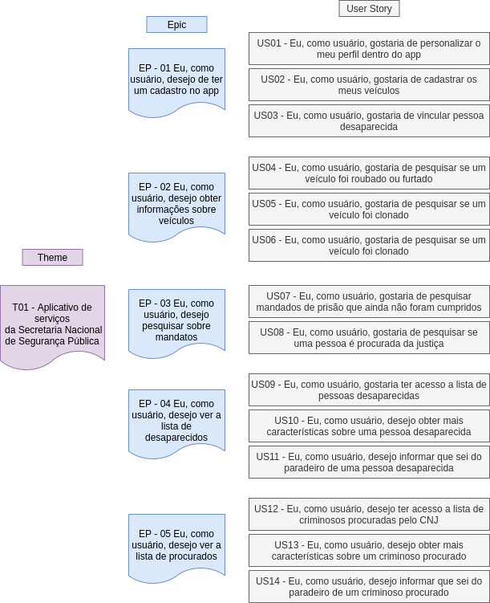
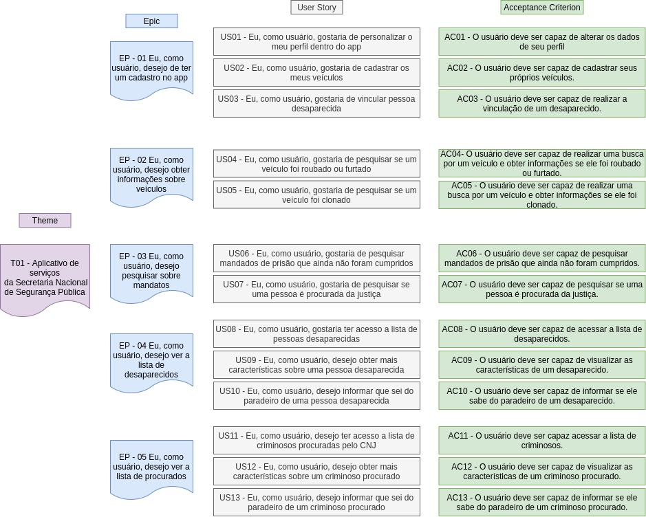

### Introdução

 &emsp;&emsp;
O Product Backlog é uma lista com prioridades dos requisitos ou funcionalidades do projeto que fornecem valor comercial ao cliente. Os itens podem ser adicionados a esse registro em qualquer momento(é assim que as alterações são introduzidas), ou seja, não precisa estar completo no início de um projeto. O conteúdo desta lista é definido pelo Product Owner. Com o tempo, o Product Backlog cresce e muda à medida que se aprende mais sobre o produto e seus usuários. Este documento contém o Product Backlog do aplicativo Sinesp Cidadão, e foi criado de acordo com os princípios da metodologia ágil.

### Product Backlog - v1

### Product Backlog - v2

### Referências

[SERRANO, Maurício; SERRANO, Milene; Requisitos – Aula 15 Elicitação, Modelagem, Análise](https://aprender3.unb.br/pluginfile.php/426765/mod_resource/content/1/Requisitos%20-%20Aula%2015a.pdf). Acesso em: 22/10/2020.

[Pressman, Cap. 3 Desenvolvimento Ágil - Engenharia de Software.](https://aprender3.unb.br/pluginfile.php/568996/mod_resource/content/2/Engenharia_de_Software_Uma_Abordagem_Pro.pdf) Acesso em: 22/10/2020.

## Versionamento
Data | Versão | Descrição | Autor 
------ | --------- | ---------- | --------
22/10/2020 | 1.0 | Product Backlog | Rafael Ribeiro
25/11/2020 | 1.1 | Product Backlog - v2 | Fellipe