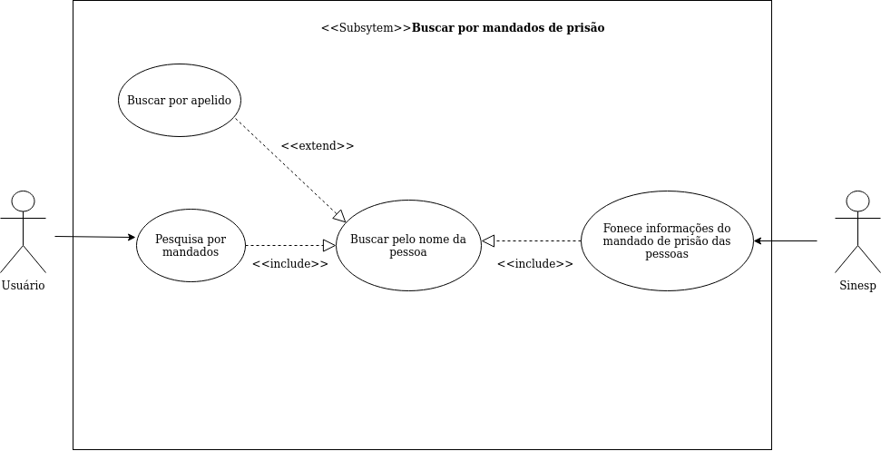
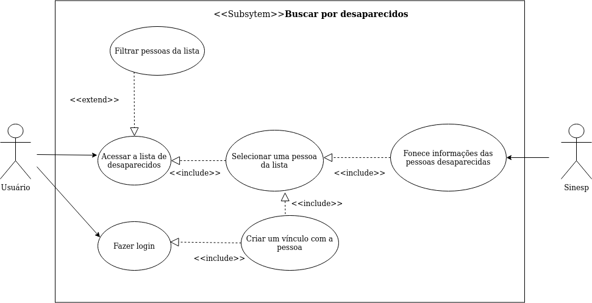
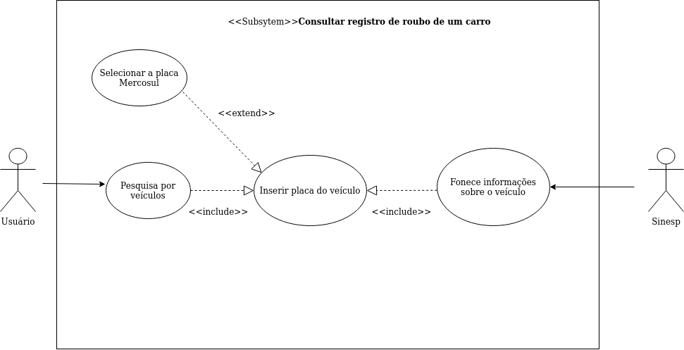

### Mandados
** **

| Sigla              | Definição                                                    |
| ------------------ | ------------------------------------------------------------ |
| Versão             | 1.0                                                          |
| Autor              | Todos                                                        |
| Descrição          | Buscar por mandados de prisão                                |
| Ator               | Sinesp  e Usuários                                           |
| Pré-condições      | Usuário ter acesso ao aplicativo                             |
| Fluxo principal    | - Usuário acesso o Sinesp - Usuário busca pelo nome ou apelido da pessoa |
| Fluxo alternativo  | Não existe                                                   |
| Fluxo de excessões | **FE1 - Sem conexão com a internet**   - O aplicativo exibe a mensagem "Não foi possível identificar sua localização, já que não conexão com a internet"  ** FE2-Nenhum resultado da pesquisa**    - O aplicativo mostra nada para  o usuário. |
| Pós condições      | Usuário ver os mandados que pesquisou                        |
| Rastreabilidade    | Baseado no requisito funcional 01 - Oferecer informações de prisão aguardando comprimento. |
** **

### Desaparecidos

** **

| Sigla              | Definição                                                    |
| ------------------ | ------------------------------------------------------------ |
| Versão             | 1.0                                                          |
| Autor              | Todos                                                        |
| Descrição          | Buscar por desaparecidos                                     |
| Ator               | Sinesp  Usuários                                          |
| Pré-condições      | Usuário ter acesso ao aplicativo                             |
| Fluxo principal    | - Usuário acesso o Sinesp - Usuário seleciona uma pessoa da lista |
| Fluxo alternativo  | Não existe                                                   |
| Fluxo de excessões | **FE1 - Sem conexão com a internet** - O aplicativo exibe a mensagem "Não foi possível identificar sua localização, já que não conexão com a internet"   **FE2-Nenhum resultado da pesquisa** - O aplicativo mostra nada para  o usuário. |
| Pós condições      | Usuário ver os desaparecidos                                 |
| Rastreabilidade    | Baseado no requisito funcional 04 - Consultar pessoas desaparecidas. |

### Consultar
** **

| Sigla              | Definição                                                    |
| ------------------ | ------------------------------------------------------------ |
| Versão             | 1.0                                                          |
| Autor              | Todos                                                        |
| Descrição          | Consultar registro de roubo de um carro                      |
| Ator               | Sinesp  Usuários                                          |
| Pré-condições      | Usuário ter acesso ao aplicativo                             |
| Fluxo principal    | - Usuário acesso o Sinesp  - Usuário insere as informações da placa do veículo |
| Fluxo alternativo  | Não existe                                                   |
| Fluxo de excessões | **FE1 - Sem conexão com a internet**    - O aplicativo exibe a mensagem "Não foi possível identificar sua localização, já que não conexão com a internet"   **FE2-Nenhum resultado da pesquisa** - O aplicativo mostra nada para  o usuário. |
| Pós condições      | Usuário ver o veículo que pesquisou                          |
| Rastreabilidade    | Baseado no requisito funcional 02 - O aplicativo deve oferecer informações de roubo ou furto de qualquer veículo. |

| Data               | Versão             | Descrição          | Autor              |
 |--------------------|--------------------|--------------------|--------------------|
| 08/10/2020         | 1.0                | Use Case | João             |
| 08/10/2020         | ** **                | Revisão | itallo             |

