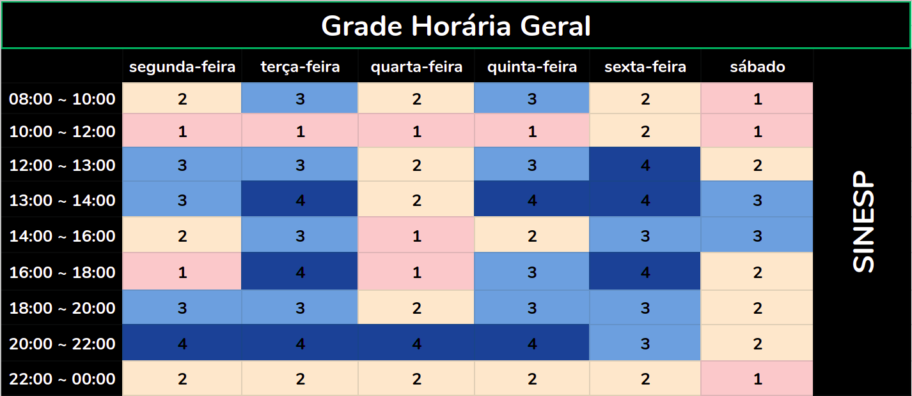

# Panejamento

 &emsp;&emsp;
O planejamento é uma ferramenta administrativa que possibilita perceber
a realidade, avaliar os caminhos, construir um referencial futuro, o
trâmite adequado e reavaliar todo o processo a que o acoplamento se
destina.

## Introdução

 &emsp;&emsp;
O Planejamento consiste da preparação, organização e estruturação do
projeto. É essencial na tomada de decisões e execução dessas mesmas
tarefas. Posteriormente, o planejamento também a confirmação se as
decisões tomadas foram acertadas. Portanto, o planejamento serve para
auxilar o grupo a se organizar nas tarefas que serão propostas durante o
projeto, de acordo com as respectivas datas de entrega.

## Heatmap

## Cronograma

 &emsp;&emsp;
A seguir, estão descritas todas as datas importantes de entrega da
equipe moldado no plano de ensino da matéria. Para cada ponto de
controle, estão definidas ao menos duas reuniões presenciais, à priori
marcadas para acontecer no sábado, mas que podem ser remarcadas caso
seja necessário. Além disso, reuniões à distância ocorrerão sob demanda,
conforme for necessário para o desenvolvimento do projeto. É importante
salientar também que o cronograma está sujeito a mudanças que, caso
ocorram, serão rastreadas no versionamento da página.

Atividade   |   Data    |   O que deve ser apresentado
----------- | --------- | ------------------------------ 
  Ponto de Controle 1   |   07/09   |   Apresentar a equipe, App selecionado para o projeto da disciplina, Ferramentas do projeto, cronograma das atividades.
  Ponto de Controle 2   |   28/09   |   Apresentação do projeto: Elicitação – Técnicas e Priorização
  Ponto de Controle 3   |   09/10   |   Entrega da apresentação do projeto: Modelagem de Requisitos: Cenários , Léxico, Use Case, Especificação Suplementar
  Ponto de Controle 4   |   28/10   |   Entrega da apresentação do projeto: Modelagem de Requisitos - Ágil(Histórias de Usuário, Backlogs, NFR Framework)
  Ponto de Controle 5   |   09/11   |   Entrega da apresentação do projeto: Análise de Requisitos: Verificação e Validação
  Ponto de Controle 6   |   26/11   |   Entrega da apresentação do projeto final

## Ferramentas Utilizadas

Ferramenta    |   Nome    |   Descrição 
------------  | --------- | -------------
 | [ZenHub](https://www.zenhub.com) | Subsistema no GitHub que permite gestão ágil do projeto/grupo com interface KanBan
 | [Github](https://github.com/) | Plataforma que será utilizada para gerir e unificar aquilo que o grupo desenvolver
 | [Google Drive](https://www.google.com/intl/pt-BR/drive/) | Plataforma para permitir a edição simultânea de arquivos por todos do grupo
 | [Telegram](https://web.telegram.org/#/login)| Ferramenta de comunicação para avisos gerais, marcar datas de reunião, entre outros
 | [Figma](https://www.figma.com/)| É um editor gráfico de vetor e prototipagem de projetos

Requisitos de Software 2020, Sinesp
[Github](https://github.com/Requisitos-de-Software/2020.1-Sinesp). All
rights reserved.

## Versionamento
Data | Versão | Descrição | Autor 
------ | --------- | ---------- | --------
15/09/2020 | 1.0 | Criação do documento| Todos
11/11/2020 | 1.1 | Adicionado a ferramenta Figma | Rafael Ribeiro
