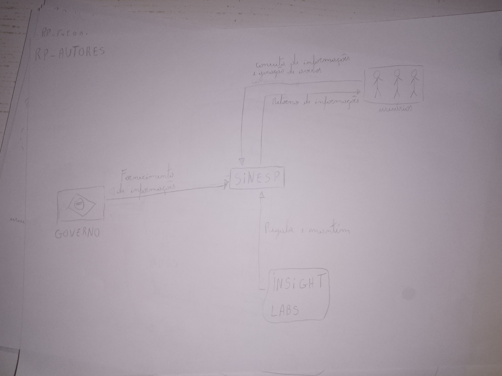
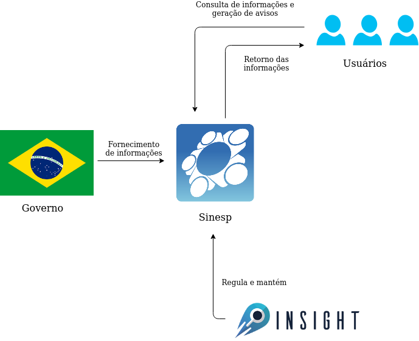
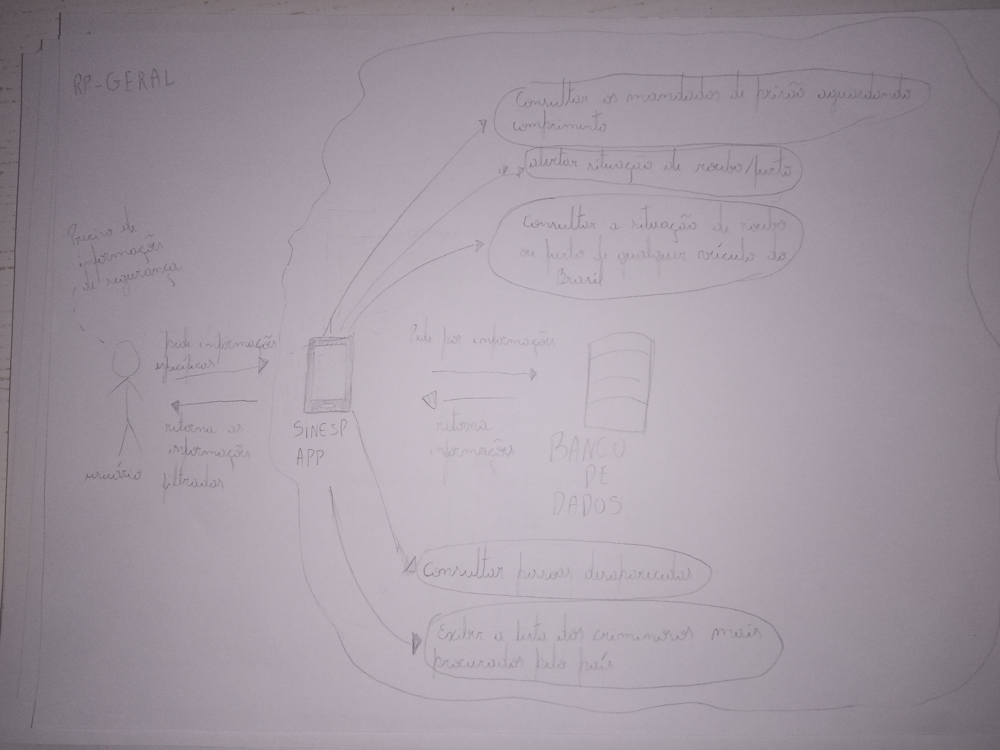
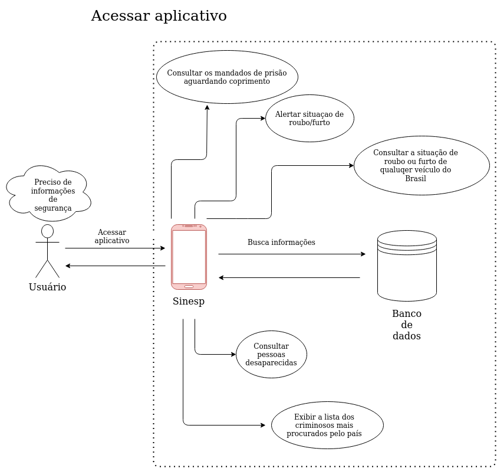

# Rich Picture

## Introdução

O Rich Picture é uma modelagem cuja notação permite analisar problemas e expressar ideias. Consiste em figuras, textos, símbolos e ícones, que são usados para ilustrar a situação que se deseja representar. O Rich Picture pode auxiliar na identificação de:

* processos de negócios e seus requisitos;
* atores envolvidos nos processos de negócio e suas responsabilidades;
* relacionamentos entre processos e atores;
* potenciais problemas e conflitos.

## RP00 Atores

## RP01 Atores

## RP02 Visão Geral

## RP03 Visão Geral

## Referências

[SERRANO, Maurício; SERRANO, Milene; Requisitos – Aula 04](https://aprender3.unb.br/pluginfile.php/501252/mod_resource/content/3/Requisitos%20-%20Aula%2004%20-%20Parte%202%20RichPicture.pdf)

## Versionamento
Data | Versão | Descrição | Autor 
------ | --------- | ---------- | --------
07/09/2020 | 1.0 | Criação dos Rich Pictures | Paulo
06/11/2020 | 1.1 | Criação da página e da Introdução, Adição da Referência e do Versionamento | Fellipe